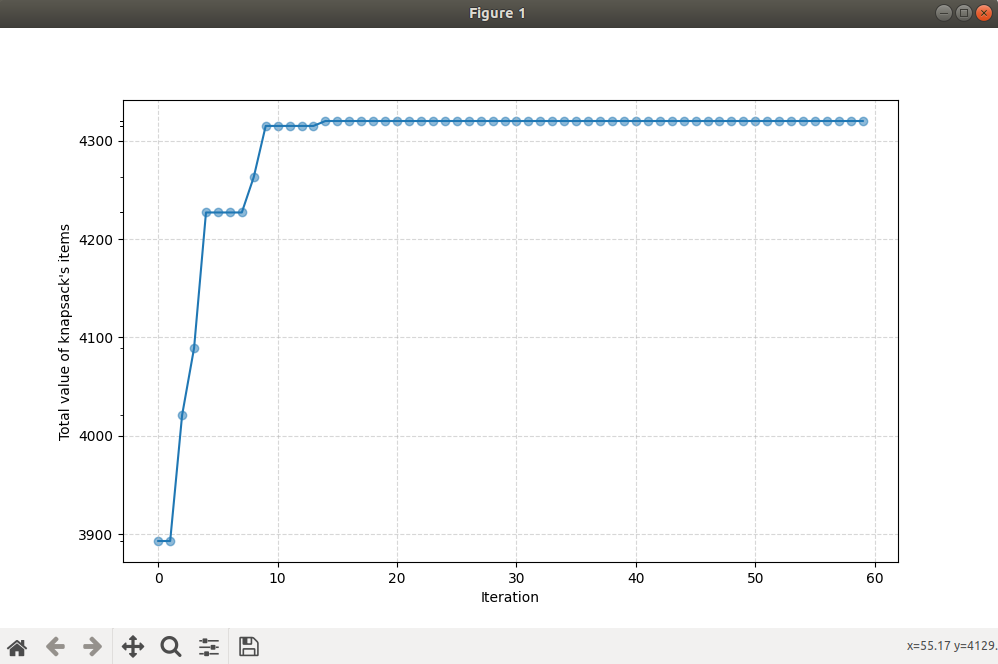

### Knapsack problem

The problem to be solved consists of choosing items, having certain critreas such as weight, volume and value, that will provide the maximum value together keeping in mind the knapsack's capacity (maximum weight that it can handle and its total volume).

We used genetic algorithms in order to solve this problem.


### GA's parameters

- *Elites* number of fittest chromosomes to keep after each generation
- *population_size* number of chromosomes 
- *max_generations* number of generations 
- *crossover rate* pre-defined parameter of the crossover rate, equals to *0.8*
- *mutation rate* pre-defined parameter of the mutaion rate, equals to *0.2*

### Testing
The class *GeneticAlgorithm* implements the needed algorithms such as *crossingOver*, *mutation*, *selection*, *fitness calculation* and *evolving*

```python
ga = GeneticAlgorithm(data, max_weight=12210, max_volume=12, max_generations=60, population_size=200, elites=2) 
```

To run the algorithm,
```python
ga.run()
```

To print the evolution graph:
```python
ga.printEvolutionGraph()
```


